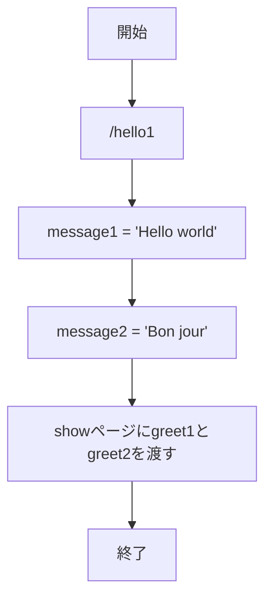
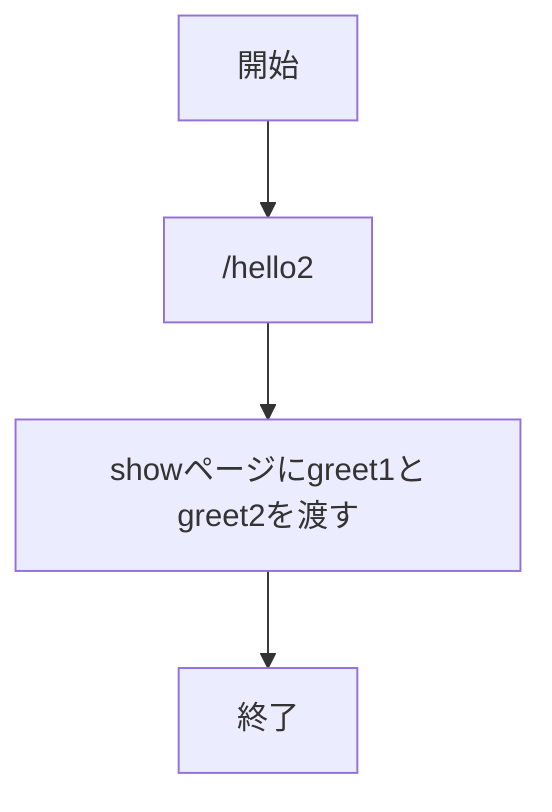
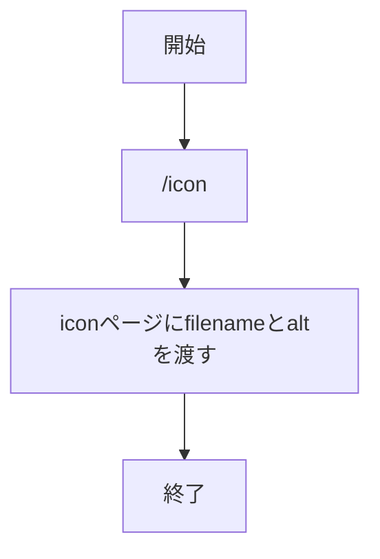
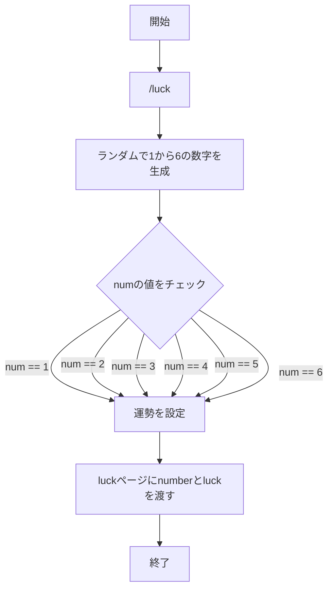
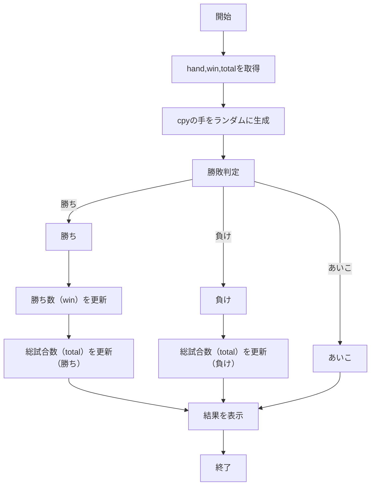
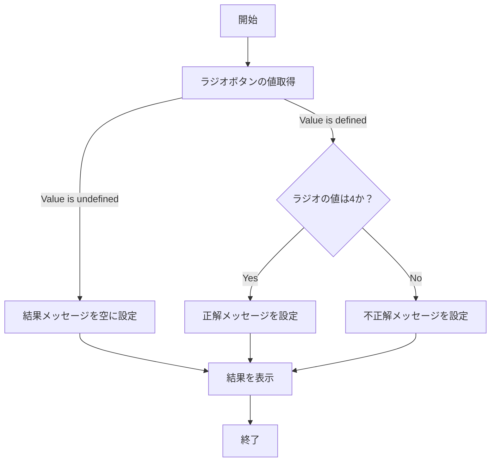
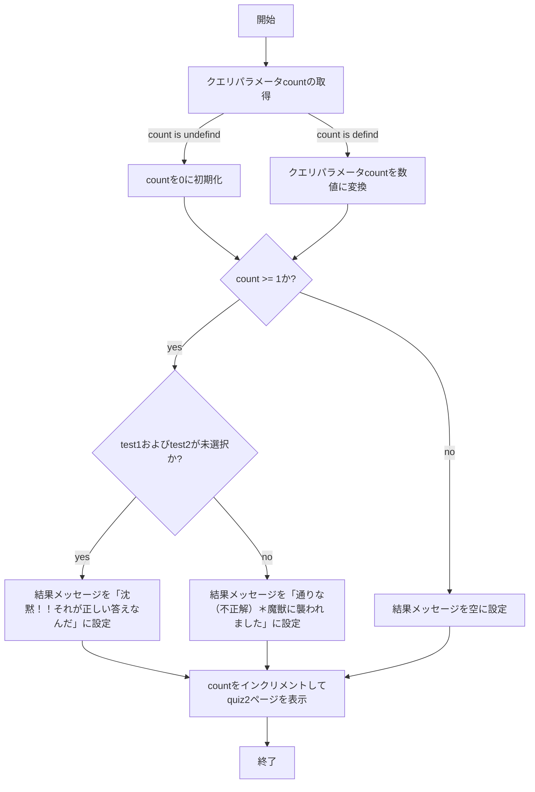
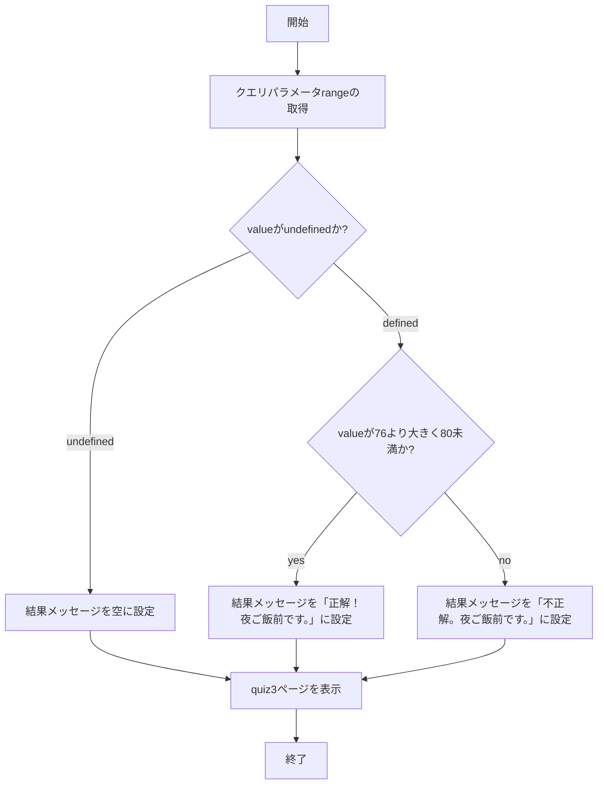

# webpro_06
## ファイルのGitでの管理
ファイルの編集履歴を編集履歴を管理するシステムであるバージョン管理システムは，変更履歴を記憶し，遡ることができる．そのためプログラム開発においておおくしようされる．バージョン管理システムには，分散リポジトリ（分散型）と単一リポジトリ（単一型）のに種類がある．分散型とは各自のパソコンにリポジトリを持ってきて変更などを加えるバージョン管理方法である．単一型とは一つのリポジトリにみんなで接続して使う方法である．本課題では分散型のバージョンアップ管理システムの一種であるGitを用いたwebサービスである「Github」を用いる．

### Githubでのバージョン管理
Githubでのファイルを自分のパソコンに持ってくるクローンは，ターミナルで以下の手順で行う．
1. 任意のディレクトリに移動する．
1. git cloneと入力する．
1. ⌘-vを押し，
リポジトリのURLが表示されたらEnterを押す.  

Githubへのファイル変更を反映させるプッシュは，ターミナルで以下の手順で行う．
1. プッシュしたいファイルのあるディレクトリへ移動する．
1. git add .　と入力する．
1. git commit -am 'コメント'　でコメントを設定する．
1. git push　と入力する．
1. Githubのアクセストークンを入力する．

## このプログラムについて

## ファイル一覧

ファイル名 | 説明
-|-
app5.js | プログラム本体
views/show.ejs | 挨拶の表示画面
views/icon.ejs | アップル社のロゴの表示画面
views/luck.ejs | おみくじの表示画面
views/janken.ejs | じゃんけんの開始画面
views/quiz.ejs | 一つ目のクイズの開始画面
views/quiz2.ejs | 二つ目のクイズの開始画面
views/quiz3.ejs | 三つ目のクイズの開始画面

## 機能説明
ここでは作成したquiz，quiz2，quiz3の機能について説明を行う．
### quiz
quizでは4択のクイズが出題される．クイズの回答にはラジオボタン属性を使用する．そのため4つの選択肢から1つのみ選択することができる．回答を選択した後，送信ボタンを押すことで，答えの判定が行われ，正解か，不正解か結果が表示される．

### quiz2
quiz2では2択のクイズが出題される．クイズの回答にはチェック属性を使用する．そのため２つの選択肢から複数選択することができる．回答を選択した後，送信ボタンを押すことで，答えの判定が行われ，正解か，不正解か結果が表示される．

### quiz3
quiz3では度合いを回答するクイズが出題される．クイズの回答にはレンジ属性を使用する．このメーターの位置で度合いを表す．回答を設定した後送信ボタンを押すことで，答えの判定が行われ，正解か，不正解か結果が表示される．

## 使用方法
### hello1
1. node app5.jsを起動する
1. Webブラウザでlocalhost:8080/hello1にアクセスする
1. 英語とフランス語で挨拶が表示される

### hello2
1. node app5.jsを起動する
1. Webブラウザでlocalhost:8080/hello2にアクセスする
1. 英語とフランス語で挨拶が表示される

### icon
1. node app5.jsを起動する
1. Webブラウザでlocalhost:8080/iconにアクセスする
1. アップル社のロゴが表示される
### luck
1. node app5.jsを起動する
1. Webブラウザでlocalhost:8080/luckにアクセスする
1. 大吉，中吉，吉，小吉，末吉，凶のいずれかが表示される

### janken
1. node app5.jsを起動する
1. Webブラウザでlocalhost:8080/jankenにアクセスする
1. 自分の手を入力する
1. 送信ボタンを押す

### quiz~quiz3

1. node app5.jsを起動する
1. Webブラウザでlocalhost:8080/quizにアクセスする
1. クイズの答えを選択し，送信ボタンを押す
1. 次の問題へのボタンを押す
1. クイズの答えを選択し，送信ボタンを押す
1. 次の問題へのボタンを押す
1. クイズの答を選択し，送信ボタンを押す

##　フローチャート
### hello1

### hello2

### icon

### luck

### janken

### Quiz 

### Quiz2 

### Quiz3 

