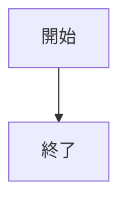
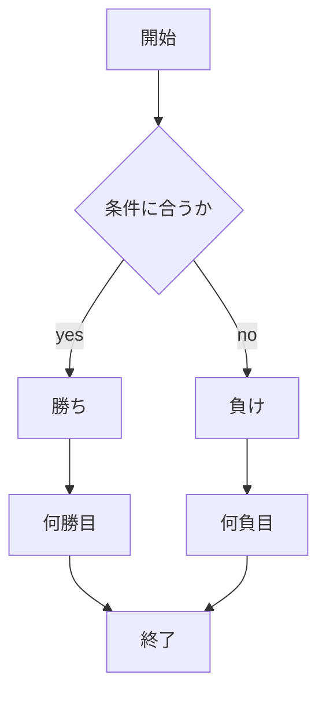

# webpro_06

## このプログラムについて

## ファイル一覧


ファイル名 | 説明
-|-
app5.js | プログラム本体
public/janken.html | じゃんけんの開始画面
```javascripts
console.log('Hello');
```

## 使用方法

1.node app5.jsを起動する
1.Webブラウザでlocalhost:8080/public/janken.htmlにアクセスする
1.じゃんけんの自分の手を入力する

##　フローチャート


